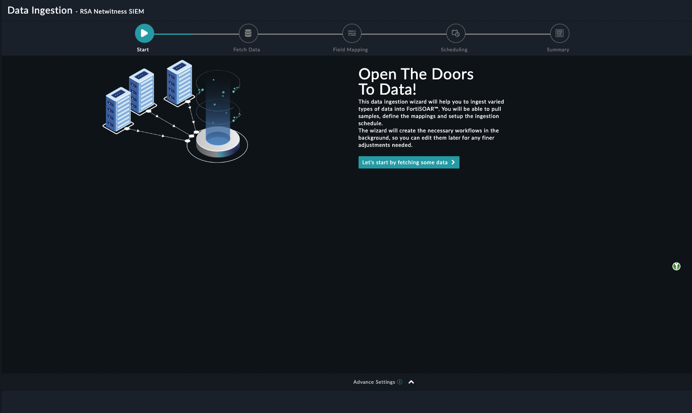
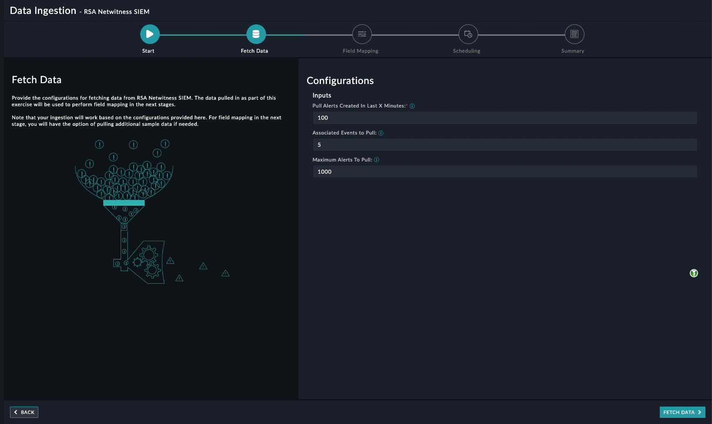
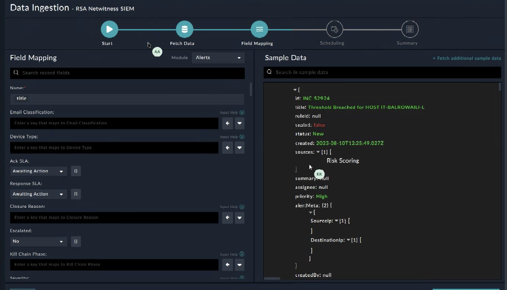

## About the connector
The RSA NetWitness Platform is an evolved SIEM and threat detection and response solution that allows security teams to rapidly detect and respond to any threat, anywhere. This connector facilitates the automated operations like Get Incident, Get Incidents by Date Range and Get Incident Related Alerts.

This document provides information about the RSA Netwitness SIEM Connector, which facilitates automated interactions, with a RSA Netwitness SIEM server using FortiSOAR&trade; playbooks. Add the RSA Netwitness SIEM Connector as a step in FortiSOAR&trade; playbooks and perform automated operations with RSA Netwitness SIEM.

### Version information

Connector Version: 1.2.0

Authored By: Fortinet

Certified: No
## Release Notes for version 1.2.0
Following enhancements have been made to the RSA Netwitness SIEM Connector in version 1.2.0:

Following enhancements have been made to the RSA Netwitness SIEM in version 1.2.0: 

<ul>
<li>
Added the following actions and playbooks: 

<ul>
<li>Get Alerts</li>
<li>Get Hosts List</li>
<li>Get Service IDs</li>
</ul></li>
</ul>

## Installing the connector

Use the <strong>Content Hub</strong> to install the connector. For the detailed procedure to install a connector, click <a href="https://docs.fortinet.com/document/fortisoar/0.0.0/installing-a-connector/1/installing-a-connector" target="_top">here</a>.

You can also use the <code>yum</code> command as a root user to install the connector:

<pre>yum install cyops-connector-rsa-netwitness-siem</pre>

## Prerequisites to configuring the connector
- You must have the credentials of RSA Netwitness SIEM server to which you will connect and perform automated operations.
- The FortiSOAR&trade; server should have outbound connectivity to port 443 on the RSA Netwitness SIEM server.

## Minimum Permissions Required
- Not applicable

## Configuring the connector
For the procedure to configure a connector, click [here](https://docs.fortinet.com/document/fortisoar/0.0.0/configuring-a-connector/1/configuring-a-connector)
### Configuration parameters

In FortiSOAR&trade;, on the Connectors page, click the <strong>RSA Netwitness SIEM</strong> connector row (if you are in the <strong>Grid</strong> view on the Connectors page) and in the <strong>Configurations</strong> tab enter the required configuration details:

<table border=1><thead><tr><th>Parameter</th><th>Description</th></tr></thead><tbody><tr><td>Server URL</td><td>URL of the RSA Netwitness SIEM server to which you will connect and perform the automated operations.
</td>
</tr><tr><td>Username</td><td>Username of the RSA Netwitness SIEM server to which you will connect and perform the automated operations.
</td>
</tr><tr><td>Password</td><td>Password of the RSA Netwitness SIEM server to which you will connect and perform the automated operations.
</td>
</tr><tr><td>Verify SSL</td><td>Specifies whether the SSL certificate for the server is to be verified or not.  By default, this option is set to True.</td></tr>
</tbody></table>

## Actions supported by the connector
The following automated operations can be included in playbooks and you can also use the annotations to access operations from FortiSOAR&trade; release 4.10.0 and onwards:
<table border=1><thead><tr><th>Function</th><th>Description</th><th>Annotation and Category</th></tr></thead><tbody><tr><td>Get Incident</td><td>Retrieves a single incident from RSA Netwitness SIEM based on the incident’s unique identifier.</td><td>get_incident  Investigation</td></tr>
<tr><td>Get Incidents by Date Range</td><td>Retrieves all incidents from RSA Netwitness SIEM based on the date and time they were created in RSA Netwitness SIEM.</td><td>get_incident_by_date_range  Investigation</td></tr>
<tr><td>Get Incident Related Alerts</td><td>Retrieves all alerts that are associated with an incident from RSA Netwitness SIEM based on the incident’s unique identifier.</td><td>get_incidents_alerts  Investigation</td></tr>
<tr><td>Get Alerts</td><td>Retrieves a list of alerts from RSA Netwitness SIEM based on the specified parameters.</td><td>get_alerts  Investigation</td></tr>
<tr><td>Get Hosts List</td><td>Retrieves a list of all the hosts' information based on the service ID specified. It provides a paged response with a standard paged response structure.</td><td>get_hosts  Investigation</td></tr>
<tr><td>Get Service IDs</td><td>Retrieves a list of all the services with their service IDs.</td><td>get_service_id  Investigation</td></tr>
</tbody></table>

### operation: Get Incident
#### Input parameters
<table border=1><thead><tr><th>Parameter</th><th>Description</th></tr></thead><tbody><tr><td>Incident ID</td><td>Specify the unique identifier of the incident based on which you want to retrieve the incident from RSA NetWitness SIEM.
</td></tr></tbody></table>

#### Output
The output contains the following populated JSON schema:

<pre>{
    "id": "",
    "title": "",
    "summary": "",
    "priority": "",
    "riskScore": "",
    "status": "",
    "alertCount": "",
    "averageAlertRiskScore": "",
    "sealed": "",
    "totalRemediationTaskCount": "",
    "openRemediationTaskCount": "",
    "created": "",
    "lastUpdated": "",
    "lastUpdatedBy": "",
    "assignee": "",
    "sources": [],
    "ruleId": "",
    "firstAlertTime": "",
    "categories": [
        {
            "id": "",
            "parent": "",
            "name": ""
        }
    ],
    "journalEntries": [
        {
            "id": "",
            "author": "",
            "notes": "",
            "created": "",
            "lastUpdated": "",
            "milestone": ""
        }
    ],
    "createdBy": "",
    "deletedAlertCount": "",
    "eventCount": "",
    "alertMeta": {
        "SourceIp": [],
        "DestinationIp": []
    }
}</pre>
### operation: Get Incidents by Date Range
#### Input parameters
<table border=1><thead><tr><th>Parameter</th><th>Description</th></tr></thead><tbody><tr><td>Start Time</td><td>Specify the timestamp based on which to retrieve incidents from RSA NetWitness SIEM. Incidents that were created on or after this timestamp are retrieved from RSA NetWitness SIEM.
</td></tr><tr><td>End Time</td><td>Specify the timestamp based on which to retrieve incidents from RSA NetWitness SIEM. Incidents that were created on or before this timestamp are retrieved from RSA NetWitness SIEM.
</td></tr><tr><td>Page Number</td><td>(Optional) Specify the page number from which to request for data.
</td></tr><tr><td>Page Size</td><td>(Optional) Specify the maximum number of records that you want to return in a single page.
</td></tr></tbody></table>

#### Output
The output contains the following populated JSON schema:

<pre>{
    "items": [
        {
            "id": "",
            "title": "",
            "summary": "",
            "priority": "",
            "riskScore": "",
            "status": "",
            "alertCount": "",
            "averageAlertRiskScore": "",
            "sealed": "",
            "totalRemediationTaskCount": "",
            "openRemediationTaskCount": "",
            "created": "",
            "lastUpdated": "",
            "lastUpdatedBy": "",
            "assignee": "",
            "sources": [],
            "ruleId": "",
            "firstAlertTime": "",
            "categories": [
                {
                    "id": "",
                    "parent": "",
                    "name": ""
                }
            ],
            "journalEntries": [
                {
                    "id": "",
                    "author": "",
                    "notes": "",
                    "created": "",
                    "lastUpdated": "",
                    "milestone": ""
                }
            ],
            "createdBy": "",
            "deletedAlertCount": "",
            "eventCount": "",
            "alertMeta": {
                "SourceIp": [],
                "DestinationIp": []
            }
        }
    ],
    "pageNumber": "",
    "pageSize": "",
    "totalPages": "",
    "totalItems": "",
    "hasNext": "",
    "hasPrevious": ""
}</pre>
### operation: Get Incident Related Alerts
#### Input parameters
<table border=1><thead><tr><th>Parameter</th><th>Description</th></tr></thead><tbody><tr><td>Incident ID</td><td>Specify the unique identifier of the incident whose associated alerts you want to retrieve the incident from RSA NetWitness SIEM.
</td></tr><tr><td>Page Number</td><td>(Optional) Specify the page number from which you want to request for data.
</td></tr><tr><td>Page Size</td><td>(Optional) Specify the maximum number of records that you want to return in a single page.
</td></tr></tbody></table>

#### Output
The output contains the following populated JSON schema:

<pre>{
    "items": [
        {
            "id": "",
            "title": "",
            "detail": "",
            "created": "",
            "source": "",
            "riskScore": "",
            "type": "",
            "events": [
                {
                    "source": {
                        "device": {
                            "ipAddress": "",
                            "port": "",
                            "macAddress": "",
                            "dnsHostname": "",
                            "dnsDomain": ""
                        },
                        "user": {
                            "username": "",
                            "emailAddress": "",
                            "adUsername": "",
                            "adDomain": ""
                        }
                    },
                    "destination": {
                        "device": {
                            "ipAddress": "",
                            "port": "",
                            "macAddress": "",
                            "dnsHostname": "",
                            "dnsDomain": ""
                        },
                        "user": {
                            "username": "",
                            "emailAddress": "",
                            "adUsername": "",
                            "adDomain": ""
                        }
                    },
                    "domain": "",
                    "eventSource": "",
                    "eventSourceId": ""
                }
            ]
        }
    ],
    "pageNumber": "",
    "pageSize": "",
    "totalPages": "",
    "totalItems": "",
    "hasNext": "",
    "hasPrevious": ""
}</pre>
### operation: Get Alerts
#### Input parameters
<table border=1><thead><tr><th>Parameter</th><th>Description</th></tr></thead><tbody><tr><td>Field Name</td><td>Specify the field name based on which the alerts are retrieved.
</td></tr><tr><td>Field Value</td><td>Specify the value for the field based on which the alerts are retrieved.
</td></tr><tr><td>Limit</td><td>(Optional) Specify the maximum number of records that you want to return in response. By default, this is set to 10.
</td></tr></tbody></table>

#### Output
The output contains the following populated JSON schema:

<pre>[
    {
        "id": "",
        "receivedTime": "",
        "status": "",
        "errorMessage": "",
        "originalHeaders": {
            "name": "",
            "description": "",
            "version": "",
            "severity": "",
            "timestamp": "",
            "signatureId": "",
            "deviceVendor": "",
            "deviceProduct": "",
            "deviceVersion": ""
        },
        "originalRawAlert": "",
        "originalAlert": {
            "instance_id": "",
            "engineUri": "",
            "detail": "",
            "events": [
                {
                    "ip_proto": "",
                    "ip_src": "",
                    "lifetime": "",
                    "medium": "",
                    "sessionid": "",
                    "rid": "",
                    "packets": "",
                    "eth_src": "",
                    "password": "",
                    "analysis_service": [],
                    "latdec_dst": "",
                    "payload": "",
                    "tcp_flags": "",
                    "longdec_src": "",
                    "action": [],
                    "city_src": "",
                    "country_dst": "",
                    "org_dst": "",
                    "requestpayload": "",
                    "responsepayload": "",
                    "sourcefile": "",
                    "event_source_id": "",
                    "esa_time": "",
                    "tcp_dstport": "",
                    "tcp_srcport": "",
                    "streams": "",
                    "domain_dst": "",
                    "sld": "",
                    "tld": "",
                    "ip_dst": "",
                    "longdec_dst": "",
                    "eth_dst": "",
                    "eth_type": "",
                    "latdec_src": "",
                    "size": "",
                    "netname": [],
                    "service": "",
                    "country_src": "",
                    "tcpflags": "",
                    "city_dst": "",
                    "time": "",
                    "org_src": "",
                    "analysis_session": [],
                    "did": "",
                    "username": []
                }
            ]
        },
        "incidentId": "",
        "partOfIncident": "",
        "incidentCreated": "",
        "pinnedEventIds": "",
        "persisted": "",
        "name": "",
        "alert": {
            "destination_country": [],
            "groupby_type": "",
            "user_summary": [],
            "groupby_domain": "",
            "source": "",
            "type": [],
            "groupby_user_src": "",
            "groupby_source_country": "",
            "groupby_destination_country": "",
            "groupby_analysis_session": "",
            "groupby_analysis_file": "",
            "signature_id": "",
            "groupby_filename": "",
            "groupby_data_hash": "",
            "groupby_domain_dst": "",
            "groupby_destination_ip": "",
            "groupby_host_dst": "",
            "groupby_source_ip": "",
            "groupby_source_username": "",
            "groupby_detector_ip": "",
            "events": [
                {
                    "data": [
                        {
                            "filename": "",
                            "size": "",
                            "hash": ""
                        }
                    ],
                    "destination": {
                        "device": {
                            "compliance_rating": "",
                            "netbios_name": "",
                            "port": "",
                            "mac_address": "",
                            "criticality": "",
                            "asset_type": "",
                            "ip_address": "",
                            "facility": "",
                            "business_unit": "",
                            "geolocation": {
                                "country": "",
                                "city": "",
                                "latitude": "",
                                "organization": "",
                                "domain": "",
                                "longitude": ""
                            }
                        },
                        "user": {
                            "email_address": "",
                            "ad_username": "",
                            "ad_domain": "",
                            "username": ""
                        }
                    },
                    "domain_src": "",
                    "description": "",
                    "source": {
                        "device": {
                            "compliance_rating": "",
                            "netbios_name": "",
                            "port": "",
                            "mac_address": "",
                            "criticality": "",
                            "asset_type": "",
                            "ip_address": "",
                            "facility": "",
                            "business_unit": "",
                            "geolocation": {
                                "country": "",
                                "city": "",
                                "latitude": "",
                                "organization": "",
                                "domain": "",
                                "longitude": ""
                            }
                        },
                        "user": {
                            "email_address": "",
                            "ad_username": "",
                            "ad_domain": "",
                            "username": ""
                        }
                    },
                    "analysis_file": "",
                    "type": "",
                    "host_scr": "",
                    "enrichment": "",
                    "user_src": "",
                    "analysis_service": "",
                    "file": "",
                    "detected_by": "",
                    "from": "",
                    "timestamp": "",
                    "custom_meta_key": "",
                    "related_links": [
                        {
                            "type": "",
                            "url": ""
                        }
                    ],
                    "domain_dst": "",
                    "user_dst": "",
                    "host_dst": "",
                    "size": "",
                    "domain": "",
                    "to": "",
                    "detector": {
                        "device_class": "",
                        "ip_address": "",
                        "product_name": ""
                    },
                    "user": "",
                    "analysis_session": "",
                    "username": ""
                }
            ],
            "timestamp": "",
            "severity": "",
            "groupby_custom_meta_key": "",
            "related_links": [],
            "host_summary": "",
            "groupby_username": "",
            "risk_score": "",
            "groupby_destination_port": "",
            "groupby_c2domain": "",
            "groupby_user_dst": "",
            "source_country": [],
            "name": "",
            "numEvents": "",
            "groupby_host_src": "",
            "groupby_analysis_service": ""
        },
        "timestamp": ""
    }
]</pre>
### operation: Get Hosts List
#### Input parameters
<table border=1><thead><tr><th>Parameter</th><th>Description</th></tr></thead><tbody><tr><td>Service ID</td><td>Specify the service ID to connect to the specific Endpoint Server.
</td></tr><tr><td>Filter Criteria</td><td>(Optional) Specify the JSON containing filter and sort criteria. The following fields are supported for filtering and sorting 'agentId', 'hostName', 'riskScore' and 'networkInterfaces.ipv4'.
</td></tr><tr><td>Page Number</td><td>(Optional) Specify the page number from which to request for data.
</td></tr><tr><td>Page Size</td><td>(Optional) Specify the maximum number of records that you want to return in a single page.
</td></tr></tbody></table>

#### Output
The output contains the following populated JSON schema:

<pre>{
    "items": [
        {
            "agentId": "",
            "hostName": "",
            "riskScore": "",
            "networkInterfaces": [
                {
                    "name": "",
                    "macAddress": "",
                    "ipv4": [],
                    "ipv6": [],
                    "networkIdv6": [],
                    "gateway": [],
                    "dns": [],
                    "promiscuous": ""
                }
            ],
            "lastSeenTime": ""
        }
    ],
    "pageNumber": "",
    "pageSize": "",
    "totalPages": "",
    "totalItems": "",
    "hasNext": "",
    "hasPrevious": ""
}</pre>
### operation: Get Service IDs
#### Input parameters
None.
#### Output
The output contains the following populated JSON schema:

<pre>[
    {
        "id": "",
        "name": "",
        "displayName": "",
        "host": "",
        "version": ""
    }
]</pre>
## Included playbooks
The `Sample - rsa-netwitness-siem - 1.2.0` playbook collection comes bundled with the RSA Netwitness SIEM connector. These playbooks contain steps using which you can perform all supported actions. You can see bundled playbooks in the **Automation** > **Playbooks** section in FortiSOAR&trade; after importing the RSA Netwitness SIEM connector.

- \> RSA Netwitness SIEM > Fetch
- \>> RSA Netwitness SIEM> Fetch Associated events for Incident
- Get Alerts
- Get Hosts List
- Get Incident Related Alerts
- Get Incidents by Date Range
- Get Service IDs
- RSA Netwitness SIEM > Ingest

**Note**: If you are planning to use any of the sample playbooks in your environment, ensure that you clone those playbooks and move them to a different collection since the sample playbook collection gets deleted during connector upgrade and delete.
## Data Ingestion Support
Use the Data Ingestion Wizard to easily ingest data into FortiSOAR&trade; by pulling events/alerts/incidents, based on the requirement.

**TODO:** provide the list of steps to configure the ingestion with the screen shots and limitations if any in this section.

## Data Ingestion Support

Use the Data Ingestion Wizard to easily ingest data into FortiSOAR™ by pulling incidents from RSA Netwitness SIEM. Currently, "incidents" in RSA Netwitness SIEM are mapped to "alerts" in FortiSOAR™. For more information on the Data Ingestion Wizard, see the "Connectors Guide" in the FortiSOAR™ product documentation. 

Configure Data Ingestion
You can configure data ingestion using the “Data Ingestion Wizard” to seamlessly map the incoming RSA Netwitness SIEM "Incidents" to FortiSOAR™ "Alerts".

The Data Ingestion Wizard enables you to configure scheduled pulling of data from RSA Netwitness SIEM into FortiSOAR™. It also lets you pull some sample data from RSA Netwitness SIEM using which you can define the mapping of data between RSA Netwitness SIEM and FortiSOAR™. The mapping of common fields is generally already done by the Data Ingestion Wizard; users mostly require to only map any custom fields that are added to the RSA Netwitness SIEM incidents. 

1.   To begin configuring data ingestion, click Configure Data Ingestion on the RSA Netwitness SIEM connector’s "Configurations" page. 
Click Let’s Start by fetching some data, to open the “Fetch Sample Data” screen.

Sample data is required to create a field mapping between the RSA Netwitness SIEM incident data and FortiSOAR™. The sample data is pulled from connector actions or ingestion playbooks.
2.  On the Fetch Data screen, provide the configurations required to fetch incidents from RSA Netwitness SIEM. You can specify the pull alerts created in past X minutes, associated, and number of alerts to fetch. The fetched data is used to create a mapping between the RSA Netwitness SIEM data and FortiSOAR™ alerts. 

Once you have completed specifying the configurations, click Fetch Data.
3.  On the Field Mapping screen, map the fields of a the RSA Netwitness SIEM incident to the fields of an RSA Netwitness SIEM present in FortiSOAR™. To map a field, click the key in the sample data to add the “jinja” value of the field. For example, to map the title parameter of a RSA Netwitness SIEM incident to the Name parameter of a FortiSOAR™ alert, click the Status field and then click the alert Severity field to populate its keys: 

For more information on field mapping, see the Data Ingestion chapter in the "Connectors Guide" in the FortiSOAR™ product documentation. Once you have completed mapping fields, click Save Mapping & Continue.
4.  Use the Scheduling screen to configure schedule-based ingestion, i.e., specify the polling frequency to RSA Netwitness SIEM, so that the content gets pulled from RSA Netwitness SIEM integration into FortiSOAR™. On the Scheduling screen, from the Do you want to schedule the ingestion? drop-down list, select Yes. In the “Configure Schedule Settings” section, specify the Cron expression for the schedule. For example, if you want to pull data from RSA Netwitness SIEM every 5 minutes, click Every X Minute, and in the minute box enter */5. This would mean that based on the configuration you have set up, data, i.e., incidents will be pulled from RSA Netwitness SIEM every 5 minutes.

Once you have completed scheduling, click Save Settings & Continue.
5.  The Summary screen displays a summary of the mapping done, and it also contains links to the Ingestion playbooks. Click Done to complete the data ingestion and exit the Data Ingestion Wizard.